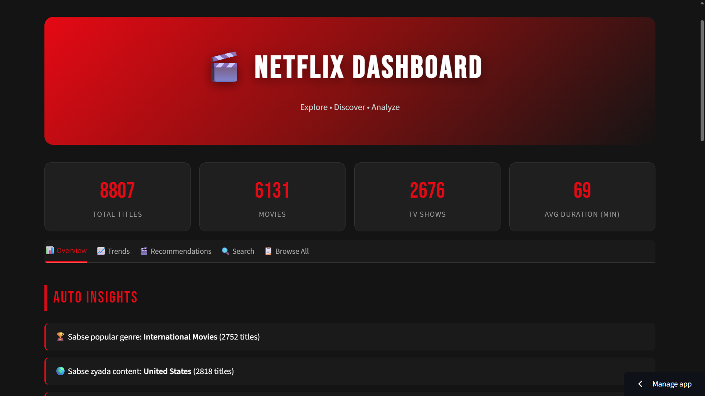

# Netflix Dashboard 📺 | Content Analysis

Interactive Streamlit dashboard to explore & analyze Netflix's movie and TV show catalog. Discover trends, genres, and hidden insights from 8800+ titles.

### 🚀 Live Demo
**[Click Here to Launch Dashboard](https://netflix-dashboard-obanuvni8dfhxkruwtatj2.streamlit.app/)**

### 📸 Dashboard Preview


### 📊 Dataset Stats
- **8807** Total Titles on Netflix
- **6131** Movies
- **2676** TV Shows  
- **69 min** Average Duration

### 🔥 Key Features

**1. Overview Tab**
- Total content breakdown by type
- Auto Insights with real-time stats

**2. Trends Analysis**
- Year-wise content addition trend
- Peak release year identification
- Content growth over time

**3. Recommendations**
- Genre-based filtering
- Country-wise content distribution
- Duration-based suggestions

**4. Search & Browse All**
- Search by title, actor, director
- Filter by genre, country, release year
- Sort by duration, date added

### 💡 Auto Insights from Dashboard
1. **Most Popular Genre:** International Movies (2752 titles)
2. **Top Content Producer:** United States (2818 titles)
3. **Peak Release Year:** 2018 with 1147 titles added
4. **Content Range:** From 1925 to 2021

### 🛠️ Tech Stack
- **Frontend**: Streamlit
- **Data Analysis**: Pandas, NumPy
- **Visualization**: Plotly, Matplotlib
- **Dataset**: Netflix Movies and TV Shows (Kaggle)

### 📈 Business Questions This Dashboard Answers
1. Which genre should Netflix invest in more?
2. In which year did Netflix add the most content?
3. What is the average movie duration on Netflix?
4. Which country produces the most Netflix content?

### 💻 Run Locally
```bash
git clone https://github.com/akash1234-design/netflix-dashboard
cd netflix-dashboard
pip install -r requirements.txt
streamlit run app.py
